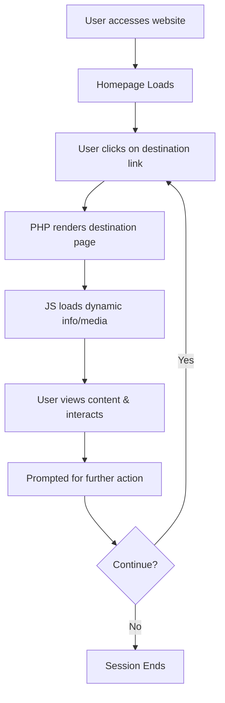

# 🌍 Travelp - Ultimate Travel Destination Explorer

**Travelp** is a comprehensive travel website prototype developed to emulate the functionality and aesthetics of a real-world travel platform. It allows users to explore a curated list of international destinations enriched with high-quality visuals and informative content. This project is ideal for demonstrating a full-stack approach using PHP, JavaScript, and multimedia integration.

---

## 📘 Table of Contents

- [Project Overview](#-project-overview)
- [Features](#-features)
- [Technology Stack](#-technology-stack)
- [Target Audience](#-target-audience)
- [System Requirements](#-system-requirements)
- [Architecture Diagram](#-architecture-diagram)
- [Workflow](#-workflow)
- [Installation & Setup](#-installation--setup)
- [Usage Guide](#-usage-guide)
- [Directory Structure](#-directory-structure)
- [Sample Pages](#-sample-pages)
- [Media Handling](#-media-handling)
- [Security Notes](#-security-notes)
- [Performance Considerations](#-performance-considerations)
- [Screenshots](#-screenshots)
- [License](#-license)
- [Author](#-author)
- [Future Enhancements](#-future-enhancements)

---

## 📖 Project Overview

Travelp functions as a digital travel guide, highlighting various global destinations like Barcelona, Bali, Africa, and more. Each destination is mapped to its own dedicated PHP page containing images, videos, and descriptive content. JavaScript is used to enhance interactivity, while multimedia files create an immersive user experience.

This project is particularly useful for showcasing:
- Dynamic web development using PHP
- Integration of media assets in web pages
- Simple data flow between front-end and back-end logic

---

## ✨ Features

- 🌐 Responsive homepage showcasing multiple destinations
- 🗺️ Destination-specific pages powered by PHP
- 🎥 Embedded videos and high-resolution image galleries
- ⚙️ JavaScript for dynamic UI behavior (e.g., loading content or interactive elements)
- 📂 Static and client-side routing simulation via dedicated pages
- 📑 Easy to extend with database or CMS

---

## 💻 Technology Stack

| Layer           | Technologies Used         |
|----------------|---------------------------|
| Frontend       | HTML5, CSS3, JavaScript   |
| Backend        | PHP 7+                    |
| Media          | JPEG, PNG, MP4            |
| Server         | Apache (XAMPP/LAMP)       |
| Deployment     | Localhost or web server   |

---

## 🎯 Target Audience

- Web development students or educators
- Developers looking to showcase frontend-backend media integration
- Hobbyists exploring PHP and static media rendering

---

## 🧩 System Requirements

- XAMPP or LAMP stack installed
- Web browser (Chrome, Firefox recommended)
- Basic knowledge of PHP/HTML for modification

---

## 🏗 Architecture Diagram

```mermaid
graph TD
    A[User Browser]
    B[Web Server (Apache)]
    C[PHP Engine]
    D[JavaScript Engine]
    E[Static Media (Images/Videos)]
    F[HTML/CSS Interface]

    A --> B
    B --> C
    C --> F
    C --> D
    D --> E
    F --> A
```

---

## 🔄 Workflow



---

## ⚙️ Installation & Setup

1. **Install XAMPP** (Windows/Linux) or **LAMP** (Linux/Mac).
2. Clone or download the repository.
3. Move the folder `Travelp/` to your `htdocs` (XAMPP) or `/var/www/html/` (LAMP).
4. Launch Apache server.
5. Visit `http://localhost/Travelp` in your browser.

---

## 🧭 Usage Guide

- Navigate to the homepage.
- Click on any destination (e.g., `barcelona.php`, `africa.php`).
- View related content including text, images, and videos.
- Use browser navigation to return or move between pages.

---

## 📁 Directory Structure

```
Travelp/
├── *.php                  # PHP pages for individual destinations
├── backend.js             # JavaScript file handling interactivity
├── images/                # Directory for image assets
├── videos/                # Directory for MP4 media
├── style.css (if present) # Custom styling
└── README.md              # Project documentation
```

---

## 🗂 Sample Pages

- `barcelona.php` - Highlights Barcelona
- `aboutus.php` - Information about the platform/team
- `africa.php` - African destinations
- Other locations include Bali, Europe, etc.

---

## 🖼 Media Handling

- Images and videos are embedded directly within PHP pages.
- Supports high-definition media and adaptive layouts.
- All media is statically served (no CDN dependency).

---

## 🔒 Security Notes

- Ensure PHP code does not expose file paths or server configs.
- Avoid direct user input unless sanitized properly.
- No authentication module is included (can be added later).

---

## ⚡ Performance Considerations

- Optimize images for web (currently in full quality).
- Implement lazy loading for media-heavy pages.
- Consider caching if dynamic data is introduced.

---

## 🖼 Screenshots

> You may place image files here with Markdown syntax like:
> ``

---

## 📄 License

This project is intended for **educational and non-commercial** use. All assets used are either free to use or created for demo purposes.

---

## 👨‍💻 Author

- **Name**: _[Your Name Here]_
- **Email**: _you@example.com_
- **GitHub**: _https://github.com/yourusername_

---

## 🚀 Future Enhancements

- 🔐 Add login/registration functionality
- 🧩 Connect with MySQL to store destinations and user feedback
- 📱 Build mobile-responsive interface using Bootstrap or Tailwind
- 🧭 Integrate maps and itinerary planners
- 📅 Add booking features and calendar view

---

